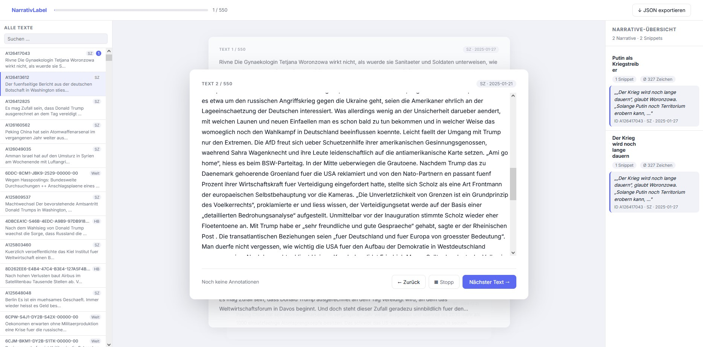

# ClaimSearch

A lightweight, zero-dependency web app for annotating narratives and framing in text corpora.

Highlight any phrase in a text, assign one or more **narrative labels** to it, and export the result as structured JSON.



---

## Features

- **Span-level annotation** — select any substring, assign narratives, add an optional comment
- **Click-to-delete** — click a highlighted span directly to open a popover with details and a delete button
- **Stacked card UI** — active text prominent in the center; adjacent texts visible in the stack for context
- **Left text-list panel** — scrollable list of all texts with live search (by ID, source, date, or content), annotation count badges, and click-to-jump navigation
- **Right narrative sidebar** — grouped overview of all narratives with snippet counts, average span length, and inline rename (double-click)
- **Multi-narrative support** — one span can carry multiple narrative labels
- **Comment field** — optional free-text note per annotation (shown as 💬 in chips)
- **JSON export** — one-click download of all annotations
- **Zero dependencies** — pure Python 3 server (`http.server`), vanilla HTML/CSS/JS frontend

---

## Quick Start

**Requirements:** Python 3.8+, a modern browser. No npm, no pip installs.

```bash
git clone https://github.com/YOUR_USERNAME/ClaimSearch.git
cd ClaimSearch/annotation-app
python -u server.py
```

Then open **http://localhost:3000** in your browser.

If no `data/texts.json` exists, the server automatically loads `data/texts_sample.json` so you can explore the app immediately. Replace it with your own data when ready (see [Data Format](#data-format) below).

---

## Data Format

### Input: `annotation-app/data/texts.json`

A JSON array of text objects. Only `id` and `text` are required.

```json
[
  {
    "id": "A11653414",
    "source": "SZ",
    "date": "2025-01-15",
    "text": "Der Volltext des Artikels oder Kommentars …"
  }
]
```

| Field    | Type   | Required | Description                          |
|----------|--------|----------|--------------------------------------|
| `id`     | string | ✅       | Unique identifier (used as JSON key) |
| `text`   | string | ✅       | Full text to annotate                |
| `source` | string | —        | Source label shown in the card header|
| `date`   | string | —        | Date shown next to source            |

See [`data/texts_sample.json`](annotation-app/data/texts_sample.json) for a working example with 10 texts.

### Output: `annotation-app/data/annotations.json`

Written automatically by the server after each annotation.

```json
{
  "A11653414": {
    "text": "... full text ...",
    "spans": [
      {
        "span": "hasn't won any matches in the last three months",
        "start": 42,
        "end": 72,
        "narratives": ["club experiencing crisis", "..."],
        "comment": "..."
      }
    ]
  }
}
```

---

## Keyboard Shortcuts

| Shortcut      | Action                  |
|---------------|-------------------------|
| `Ctrl + Enter`| Save annotation         |
| `Escape`      | Close popup / popover   |
| `Enter`       | Add new narrative (in popup input) |

---

## Project Structure

```
ClaimSearch/
├── annotation-app/
│   ├── server.py              # Python HTTP server (no dependencies)
│   ├── public/
│   │   ├── index.html         # Single-page app
│   │   ├── style.css          # All styles
│   │   └── app.js             # All frontend logic
│   └── data/
│       ├── texts_sample.json        # Example input (10 texts)
│       ├── annotations_sample.json  # Example output
│       ├── texts.json               # ← your real data (gitignored)
│       └── annotations.json         # ← written at runtime (gitignored)
└── .gitignore
```

---

## API

The server exposes a minimal REST API on `localhost:3000`:

| Method   | Path                                      | Description              |
|----------|-------------------------------------------|--------------------------|
| `GET`    | `/api/texts`                              | Load all texts           |
| `GET`    | `/api/annotations`                        | Load all annotations     |
| `POST`   | `/api/annotations`                        | Save a new span          |
| `DELETE` | `/api/annotations/:textId/spans/:index`   | Delete a span by index   |
| `POST`   | `/api/rename-narrative`                   | Rename a narrative globally |

---

## License

MIT; feel free to adapt for your own annotation projects.
